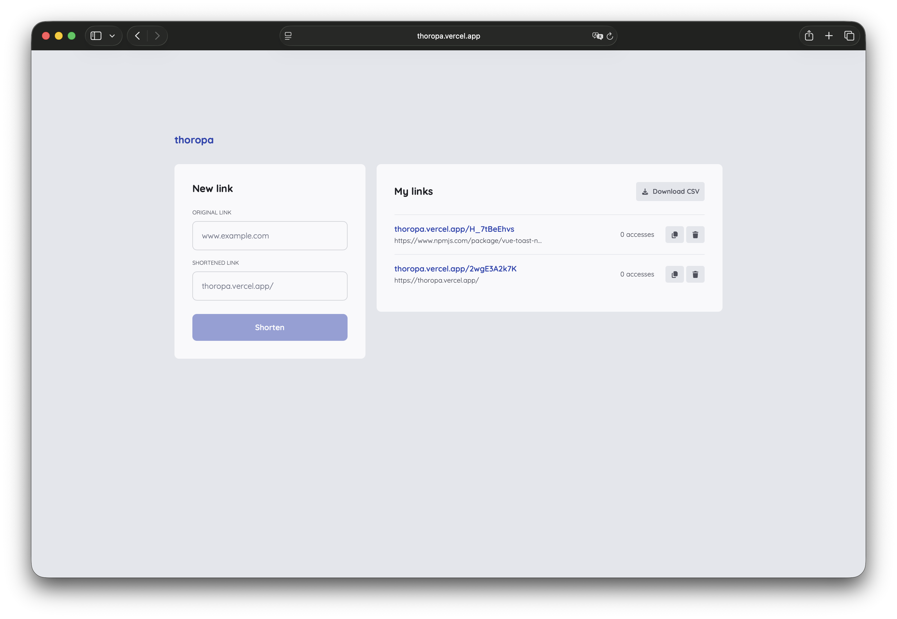

# Thoropa

> Espécie `Thoropa taophora` é endêmica da Serra do Mar e do litoral de São Paulo.

> Encurtador de links fullstack com frontend em Vue 3 e backend em Go, com suporte a execução local e deploy em AWS Lambda.


---



---

## Visao Geral

O Thoropa conecta:

- Frontend em Vue 3 + Vite para interface de criacao e visualizacao de links
- Backend em Go + Gin para API de encurtamento e consulta
- DynamoDB como persistencia
- AWS Lambda para execucao serverless em producao

Hoje o projeto ja possui:

- Cadastro de link original
- Consulta de link por id
- Listagem de links por IP cliente
- Exclusao de link por id
- Adapter Gin -> Lambda com API Gateway v2

---

## Stack Tecnologica

### Frontend

- Vue 3
- Vite
- TypeScript
- Vue Router
- Font Awesome

### Backend

- Go 1.25+
- Gin
- AWS SDK Go v2 (DynamoDB)
- AWS Lambda Go
- aws-lambda-go-api-proxy (adapter do Gin)

### Infra local

- Docker Compose
- DynamoDB Local
- DynamoDB Admin

---

## Estrutura do Projeto

```bash
.
├── .github
│   └── workflows
│       └── lambda_deployment.yaml
├── api
│   ├── cmd
│   │   └── api
│   │       └── main.go
│   ├── docker-compose.yml
│   ├── go.mod
│   ├── internal
│   │   ├── database
│   │   │   └── dynamo.go
│   │   ├── handler
│   │   │   └── link-handler.go
│   │   ├── model
│   │   │   └── model-link.go
│   │   ├── repository
│   │   │   └── link-repository.go
│   │   ├── router
│   │   │   └── router.go
│   │   └── service
│   │       └── service-link.go
│   └── scripts
│       └── init-dynamo.sh
├── app
│   ├── index.html
│   ├── package.json
│   └── src
│       ├── main.ts
│       └── components
│           ├── atoms
│           ├── molecules
│           ├── organisms
│           ├── pages
│           └── templates
└── README.md
```

---

## Pre-requisitos

- Node.js 18+
- npm
- Go 1.25+
- Docker + Docker Compose

---

## Variaveis de Ambiente

### Backend (api/.env)

```env
# true para rodar servidor HTTP local na porta 8080
IS_RUNNING_LOCAL=true

# true para usar DynamoDB Local em http://localhost:8000
DYNAMO_LOCAL=true

# para AWS real (quando DYNAMO_LOCAL=false)
AWS_REGION=sa-east-1
AWS_ACCESS_KEY_ID=...
AWS_SECRET_ACCESS_KEY=...
```

### Frontend

O frontend depende da variavel abaixo para apontar para a API:

```env
# app/.env
VITE_API_URL=http://localhost:8080
```

---

## Instalacao

### 1. Frontend

```bash
cd app
npm install
```

### 2. Backend

```bash
cd ../api
go mod tidy
```

---

## Como Rodar em Desenvolvimento

### 1. Subir DynamoDB Local

```bash
cd api
docker compose up -d
```

Servicos locais:

- DynamoDB Local: http://localhost:8000
- DynamoDB Admin: http://localhost:8001

### 2. Rodar API local (Gin)

```bash
cd api
IS_RUNNING_LOCAL=true DYNAMO_LOCAL=true go run ./cmd/api/main.go
```

API local:

- Backend: http://localhost:8080

### 3. Rodar frontend

```bash
cd app
npm run dev
```

Frontend local:

- App: http://localhost:5173

---

## Build

### Frontend

```bash
cd app
npm run build
npm run preview
```

### Backend (binario Linux)

```bash
cd api
GOOS=linux GOARCH=amd64 CGO_ENABLED=0 go build -o bootstrap ./cmd/api/main.go
```

---

## Rotas do Frontend

- / -> Pagina principal
- /:id -> Tela de redirecionamento

---

## Endpoints da API

### GET /

Health check simples da API.

Resposta:

```json
{
  "message": "API rodando 🚀"
}
```

### POST /link

Cria um novo link.

Body:

```json
{
  "original": "https://exemplo.com/minha-url"
}
```

### GET /link/:id

Busca um link pelo id.

### GET /links

Lista links pelo IP do cliente (normalizado no backend).

### DELETE /link/:id

Deleta um link pelo id.

---

## Deploy AWS Lambda

O workflow de deploy esta em:

- .github/workflows/lambda_deployment.yaml

Ele faz:

- Build do binario bootstrap
- Publicacao na funcao Lambda configurada

Observacao importante:

- role-to-assume deve ser ARN de IAM Role, no formato:
  arn:aws:iam::<account-id>:role/<role-name>

---

## Autor

Lucas Carinhanha

- GitHub: https://github.com/car1nhanha

---

Feito com codigo, cafe e um pouco de caos.
